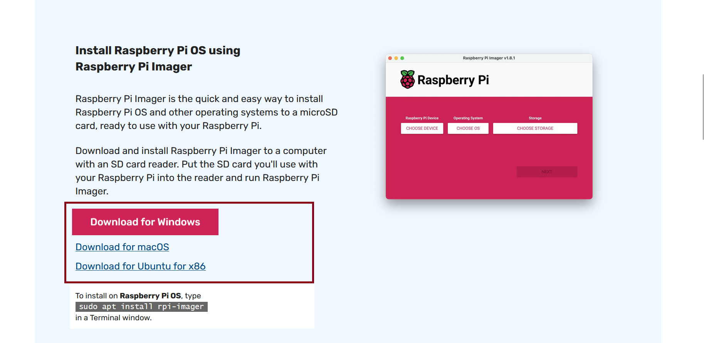
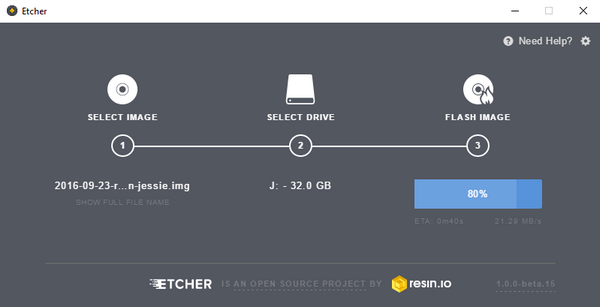

# 📘 Guide Complet : Gérer un Raspberry Pi

## 📑 Sommaire

1. [Préparer le matériel](#-1-préparer-le-matériel)
2. [Installer Raspberry Pi OS](#-2-installer-raspberry-pi-os)
3. [Connexion à distance (SSH)](#-3-connexion-à-distance-ssh)
4. [Configuration réseau](#-4-configuration-réseau)
5. [Installer Docker](#-5-installer-docker)
6. [Installer Docker Compose](#-6-installer-docker-compose)
7. [Organiser les services](#-7-organiser-les-services)
8. [Mises à jour et maintenance](#-8-mises-à-jour-et-maintenance)
9. [Sécuriser le Raspberry Pi](#-9-sécuriser-le-raspberry-pi)
10. [Sauvegarder les données](#-10-sauvegarder-les-données)
11. [Surveiller le système](#-11-surveiller-le-système)
12. [Bonnes pratiques](#-12-bonnes-pratiques)
13. [Ressources utiles](#-13-ressources-utiles)

---

## 🧰 1. Préparer le matériel

Matériel nécessaire :
- Un Raspberry Pi (modèle 3, 4 ou 5 recommandé)
- Une carte microSD ≥ 16 Go (classe 10 minimum)
- Une alimentation compatible
- Un clavier, une souris et un écran (ou accès SSH)
- Une connexion Internet (Wi-Fi ou Ethernet)

---

## 💽 2. Installer Raspberry Pi OS

Télécharge le Raspberry Pi Imager :  
➡️ [https://www.raspberrypi.com/software/](https://www.raspberrypi.com/software/)

### Étapes :

1. Choisir l’exécutable adapté à ton système d’exploitation :
   

2. Configurer les paramètres avant l’écriture (nom d’utilisateur, mot de passe, Wi-Fi, SSH) :
   

3. Insérer la carte SD dans le PC **avant** de lancer le flashage :
   

4. Insérer la carte SD dans le Raspberry Pi et démarrer.

---

## 🔐 3. Connexion à distance (SSH)

Depuis un terminal :

```bash
ssh <pi_user>@<pi_ip_local>
```

``pi_user``: utilisateur que vous avez configurer avant de flasher la carte ssd

``pi_ip_local``: IP de vorte rasberri oi en local

Si ça échoue, utiliser l’adresse IP (`hostname -I` sur le Pi).

---

## 🌐 4. Configuration réseau

Attribuer une IP statique pour un accès réseau fiable.

### 📌 Contexte : LAN, adressage IP et configuration statique

Ton Raspberry Pi se connecte à un **réseau local (LAN)**, généralement via ta box Internet ou un routeur domestique.  
Dans ce réseau local, chaque appareil se voit attribuer une **adresse IP privée** (typiquement de la forme `192.168.x.x`) afin de pouvoir communiquer avec les autres équipements.

Par défaut, ton routeur utilise un système **DHCP** qui attribue dynamiquement une adresse IP à chaque appareil.  
Cependant, cette IP peut changer à chaque redémarrage, ce qui complique l'accès distant (ex. SSH ou services web).

Pour éviter cela, on configure une **IP statique**. Par exemple :

- `192.168.1.100/24` : IP fixe de ton Raspberry Pi
- `192.168.1.1` : passerelle (ta box)
- `1.1.1.1` et `8.8.8.8` : serveurs DNS (Cloudflare et Google)

> ⚠️ Choisis une IP **en dehors du pool DHCP** de ta box pour éviter tout conflit.

### Modifier le fichier de configuration :

```bash
sudo nano /etc/dhcpcd.conf
```

Ajouter à la fin :

```
interface wlan0
static ip_address=192.168.1.100/24
static routers=192.168.1.1
static domain_name_servers=1.1.1.1 8.8.8.8
```

---

## 🐳 5. Installer Docker

```bash
curl -sSL https://get.docker.com | sh
sudo usermod -aG docker pi
```

Redémarrer ensuite :

```bash
sudo reboot
```

Tester :

```bash
docker run hello-world
```

---

## ⚙️ 6. Installer Docker Compose

```bash
sudo apt install docker-compose -y
```

---

## 📂 7. Organiser les services

Structure conseillée :

```bash
mkdir -p ~/services/mon-service
cd ~/services/mon-service
nano docker-compose.yml
```

---

## 🔄 8. Mises à jour et maintenance

```bash
sudo apt update && sudo apt full-upgrade -y
sudo apt autoremove -y
sudo apt clean
```

---

## 🔐 9. Sécuriser le Raspberry Pi

Changer mot de passe :

```bash
passwd
```

Installer fail2ban :

```bash
sudo apt install fail2ban -y
```

Pare-feu (UFW) :

```bash
sudo apt install ufw -y
sudo ufw allow ssh
sudo ufw enable
```

---

## 💾 10. Sauvegarder les données

### Avec `rsync` :

```bash
rsync -avz /home/pi user@ip_serveur:/sauvegarde/raspi/
```

### Image de la carte SD :

Depuis un PC :

```bash
sudo dd if=/dev/sdX of=raspberry-backup.img bs=4M status=progress
```

---

## 📊 11. Surveiller le système

Vérifier température :

```bash
vcgencmd measure_temp
```

RAM :

```bash
free -h
```

Processus :

```bash
htop
```

Installer `glances` :

```bash
sudo apt install glances -y
glances
```

---

## ✅ 12. Bonnes pratiques

- Ne pas utiliser le compte root directement
- Documenter chaque projet
- Sauvegarder régulièrement
- Redémarrer de temps en temps
- Surveiller espace disque : `df -h`

---

## 🔗 13. Ressources utiles

- Documentation Raspberry Pi : [raspberrypi.com/documentation](https://www.raspberrypi.com/documentation/)
- Forum d’entraide : [forums.raspberrypi.com](https://forums.raspberrypi.com)
- Tutoriels français : [framboise314.fr](https://www.framboise314.fr/)

---
