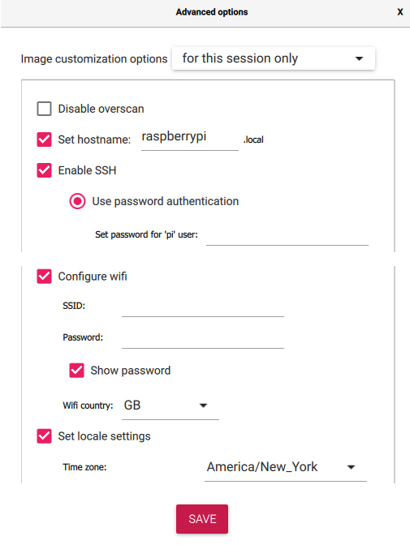

# 📘 Guide Complet : Gérer un Raspberry Pi

## 📑 Sommaire

1. [Préparer le matériel](#-1-préparer-le-matériel)  
2. [Installer Raspberry Pi OS](#-2-installer-raspberry-pi-os)  
3. [Connexion à distance (SSH)](#-3-connexion-à-distance-ssh)  
   - [3.1 Comprendre l’adressage IP local](#-31-comprendre-ladressage-ip-local)  
   - [3.2 Utiliser un nom de domaine dynamique (DuckDNS)](#-32-utiliser-un-nom-de-domaine-dynamique-duckdns)  
   - [3.3 Ouvrir les ports nécessaires (Pare-feu UFW)](#-33-ouvrir-les-ports-nécessaires-pare-feu-ufw)  
4. [Installer Docker](#-4-installer-docker)  
5. [Installer Docker Compose](#-5-installer-docker-compose)  
6. [Organiser les services](#-6-organiser-les-services)  
7. [Mises à jour et maintenance](#-7-mises-à-jour-et-maintenance)  
8. [Surveiller le système](#-8-surveiller-le-système)  
9. [Bonnes pratiques](#-9-bonnes-pratiques)  
10. [Ressources utiles](#-10-ressources-utiles)

---

## 🧰 1. Préparer le matériel

Voici ce dont tu as besoin pour démarrer avec ton Raspberry Pi :

- ✅ Un **Raspberry Pi** (modèle 3, 4 ou 5 recommandé pour de bonnes performances)
- 💾 Une **carte microSD** de 16 Go minimum (classe 10 recommandée pour la rapidité)
- 🔌 Une **alimentation** adaptée (officielle ou de qualité équivalente)
- 🖥️ Un **écran**, un **clavier** et une **souris** (optionnels si tu utilises SSH)
- 🌐 Une **connexion Internet**, en Wi-Fi ou Ethernet

> 💡 Conseil : plus ta carte SD est rapide, plus ton Raspberry Pi sera réactif.

---

## 💽 2. Installer Raspberry Pi OS

### 🧩 Étape 1 – Télécharger et installer Raspberry Pi Imager

➡️ [https://www.raspberrypi.com/software/](https://www.raspberrypi.com/software/)

Ce logiciel permet de flasher automatiquement le système sur ta carte microSD.

---

### 🛠️ Étape 2 – Configurer le système à installer

1. Lance le Raspberry Pi Imager et choisis ton système :
   

2. Clique sur la roue dentée ⚙️ (ou appuie sur `Ctrl+Shift+X`) pour préconfigurer :
   - nom d’utilisateur
   - mot de passe
   - Wi-Fi
   - SSH

   

3. Insère la carte microSD dans ton PC, puis lance le flashage :
   

---

### 🚀 Étape 3 – Premier démarrage

Une fois l’écriture terminée :
- Insère la carte dans le Raspberry Pi
- Branche l’alimentation
- Le système démarre automatiquement !

---

## 🔐 3. Connexion à distance (SSH)

L’objectif ici est de te connecter à ton Raspberry Pi sans écran ni clavier. On passe donc par SSH.

---

### 🔍 3.1 Comprendre l’adressage IP local

- Ton Raspberry Pi reçoit une **adresse IP locale dynamique** via ton routeur (ex : `192.168.1.54`)
- Cette IP peut changer → problématique pour une connexion stable

Deux solutions :
- 🔒 Configurer une **IP fixe**
- 🌍 Utiliser un **nom de domaine dynamique** (voir ci-dessous)

---

### 🌐 3.2 Utiliser un nom de domaine dynamique (DuckDNS)

Pour accéder à ton Raspberry Pi **depuis Internet**, même si ton IP publique change.

---

#### 🦆 Étape 1 – Créer ton compte DuckDNS

1. Va sur [https://www.duckdns.org](https://www.duckdns.org)  
2. Connecte-toi avec GitHub ou Google  
3. Crée ton sous-domaine (`monpi.duckdns.org`)  
4. Récupère ton **token d’authentification**


---

#### 🛠️ Étape 2 – Créer le script de mise à jour

Crée un dossier et un script :

```bash
mkdir -p ~/duckdns
nano ~/duckdns/duck.sh
````

Colle ce contenu :

```bash
#!/bin/bash

LOG_FILE=~/duckdns/duck.log
EMAIL="ton.email@exemple.com"
TOKEN="TON_TOKEN"
DOMAIN="ton-sous-domaine"

echo url="https://www.duckdns.org/update?domains=$DOMAIN&token=$TOKEN&ip=" | curl -k -o $LOG_FILE -K -

if ! grep -q "OK" "$LOG_FILE"; then
    echo "Échec de mise à jour DuckDNS pour $DOMAIN à $(date)" | mail -s "[ALERTE] Échec DuckDNS" $EMAIL
fi
```

> ℹ️ Laisse `ip=` vide → DuckDNS détectera l’IP publique automatiquement.

---

#### 🧠 Explication pédagogique du script

| Ligne          | Fonction                                   |                                    |
| -------------- | ------------------------------------------ | ---------------------------------- |
| `#!/bin/bash`  | Lance l'interpréteur bash                  |                                    |
| `LOG_FILE=...` | Fichier log où sera enregistrée la réponse |                                    |
| `EMAIL="..."`  | Adresse mail à alerter en cas d’échec      |                                    |
| \`echo url=... | curl ...\`                                 | Envoie une requête HTTPS à DuckDNS |
| `grep -q "OK"` | Vérifie si la mise à jour a réussi         |                                    |
| `mail -s ...`  | Envoie un mail en cas d’erreur             |                                    |

---

#### 📅 Étape 3 – Planifier la mise à jour automatique

1. Rends le script exécutable :

```bash
chmod +x ~/duckdns/duck.sh
```

2. Ajoute-le à la crontab :

```bash
crontab -e
```

Voici une version améliorée et plus pédagogique de ta section :

---

### 🕒 3. Ajouter une tâche planifiée (toutes les 5 minutes)

Pour que ton nom de domaine DuckDNS soit mis à jour automatiquement avec ton adresse IP actuelle, tu dois configurer une tâche planifiée (appelée *cron job*).

👉 Voici la ligne à ajouter à ton fichier `crontab` pour exécuter le script `duck.sh` toutes les **5 minutes** :

```cron
*/5 * * * * ~/duckdns/duck.sh >/dev/null 2>&1
```

#### 📌 Explication de chaque partie :

* `*/5` : signifie "toutes les 5 minutes".
* `* * *` : tous les jours, toutes les heures, tous les mois.
* `~/duckdns/duck.sh` : chemin vers le script DuckDNS que tu veux exécuter.
* `>/dev/null 2>&1` : permet de ne pas afficher les messages de sortie ni d'erreur (cela rend l'exécution silencieuse).

> ✅ **Résultat :** ton Raspberry Pi mettra à jour ton adresse IP publique sur DuckDNS automatiquement toutes les 5 minutes, sans intervention de ta part.

---

Souhaites-tu que je t’ajoute aussi la commande pour modifier le `crontab` facilement ?


---

### 🛡️ 3.3 Ouvrir les ports nécessaires (Pare-feu UFW)

> UFW = **Uncomplicated Firewall** : un pare-feu simple à configurer.

#### 🔧 Étapes de configuration

1. Installer UFW :

```bash
sudo apt install ufw -y
```

2. Autoriser SSH :

```bash
sudo ufw allow ssh
```

3. (Optionnel) Autoriser HTTP et HTTPS :

```bash
sudo ufw allow 80
sudo ufw allow 443
```

4. Activer UFW :

```bash
sudo ufw enable
```

5. Vérifier l’état :

```bash
sudo ufw status
```

---

#### 🧠 Explication des ports ouverts

| Port | Service | Pourquoi ?                        |
| ---- | ------- | --------------------------------- |
| 22   | SSH     | Connexion à distance              |
| 80   | HTTP    | Serveur web classique             |
| 443  | HTTPS   | Site sécurisé avec certificat SSL |

---

## 🐳 4. Installer Docker

Docker permet de lancer des services sous forme de "conteneurs" isolés, très pratique sur Raspberry Pi.

```bash
curl -sSL https://get.docker.com | sh
sudo usermod -aG docker pi
```

Redémarre ton Pi :

```bash
sudo reboot
```

Teste l’installation :

```bash
docker run hello-world
```

---

## ⚙️ 5. Installer Docker Compose

Docker Compose permet de lancer plusieurs services avec un seul fichier `.yml`.

```bash
sudo apt install docker-compose -y
```

---

## 📂 6. Organiser les services

Structure conseillée :

```bash
mkdir -p ~/services/mon-service
cd ~/services/mon-service
nano docker-compose.yml
```

> 📁 Tu peux regrouper tous tes projets dans `~/services/` pour mieux t’organiser.

---

## 🔄 7. Mises à jour et maintenance

À exécuter régulièrement pour maintenir ton système :

```bash
sudo apt update && sudo apt full-upgrade -y
sudo apt autoremove -y
sudo apt clean
```

---

## 📊 8. Surveiller le système

Quelques commandes utiles :

* 🌡️ Température :

```bash
vcgencmd measure_temp
```

* 🧠 Mémoire :

```bash
free -h
```

* ⚙️ Processus :

```bash
htop
```

* 📈 Outil complet :

```bash
sudo apt install glances
```
